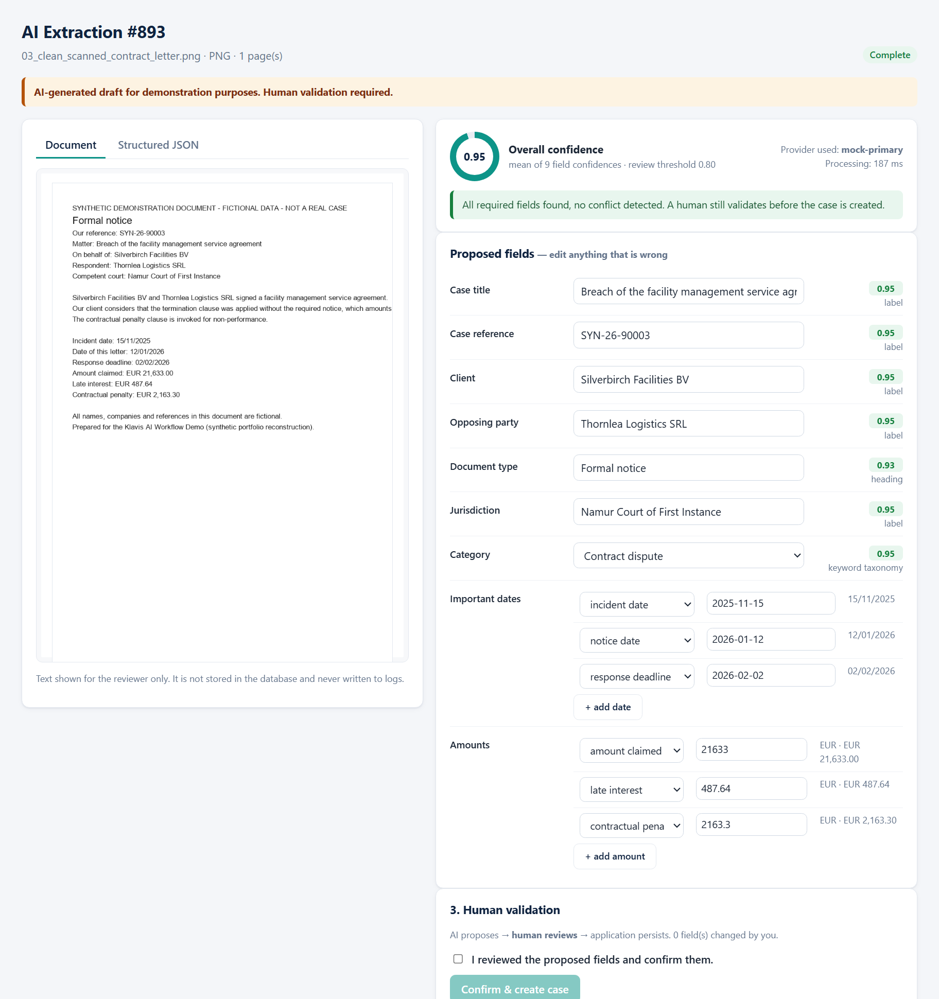
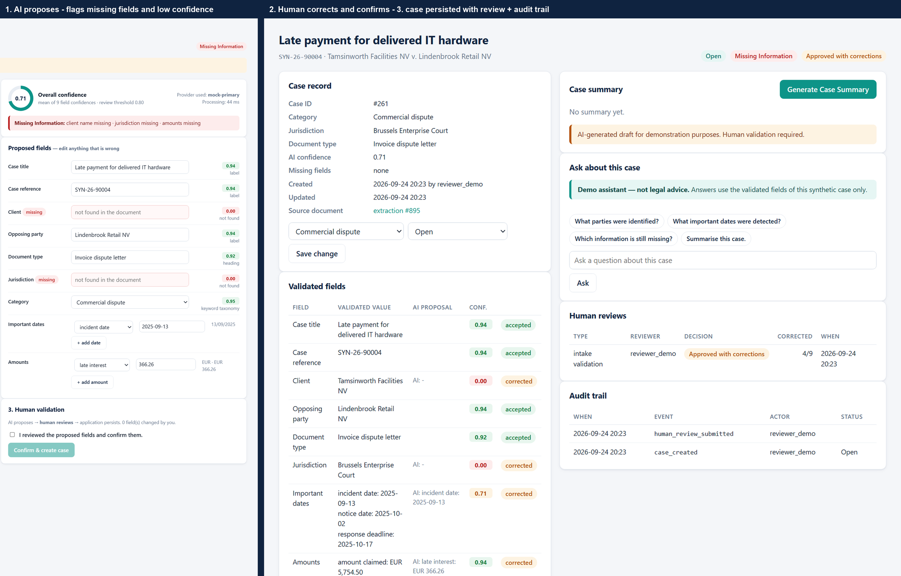
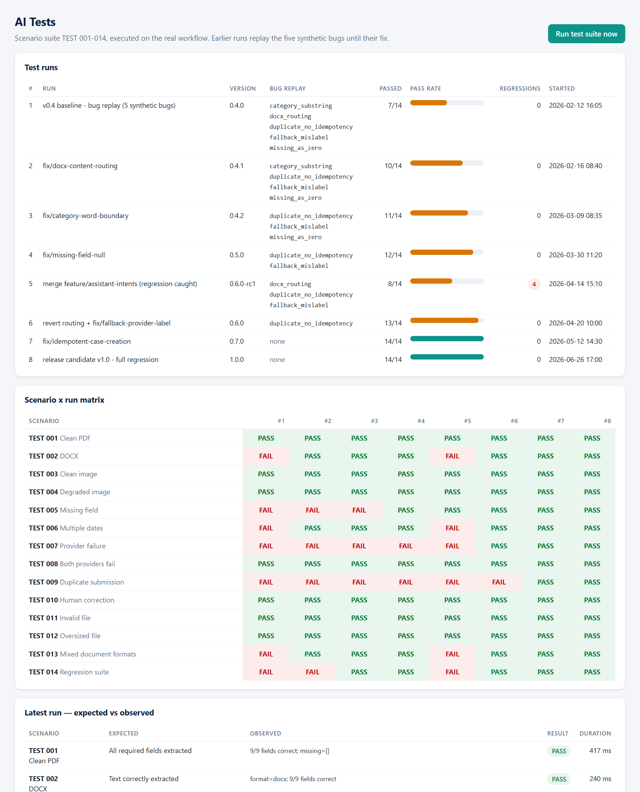
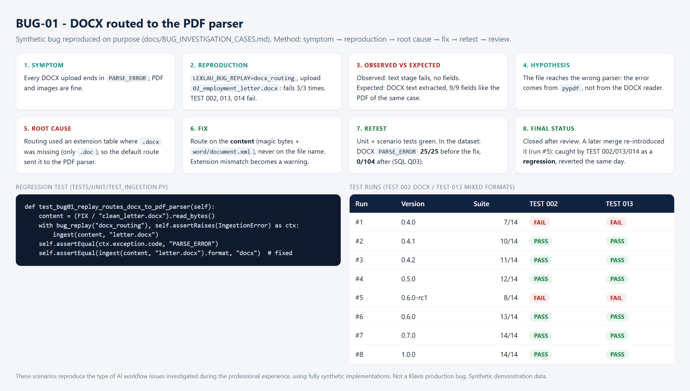
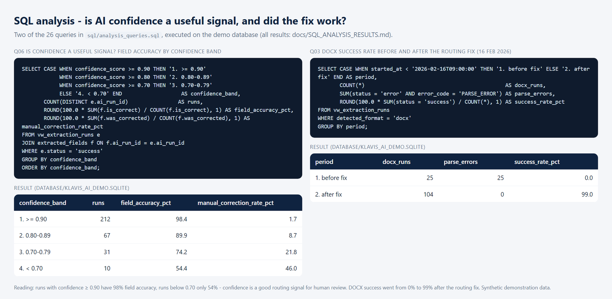
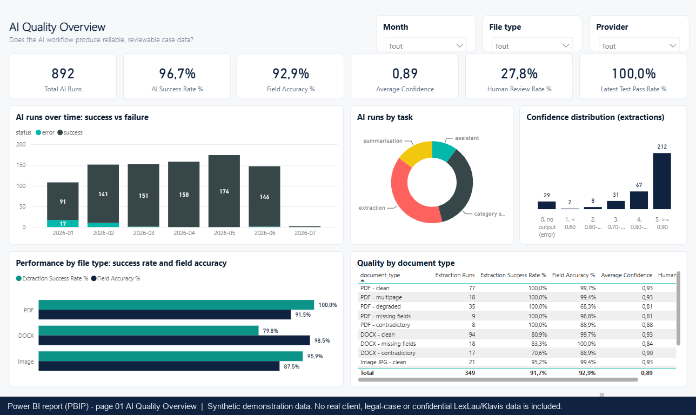
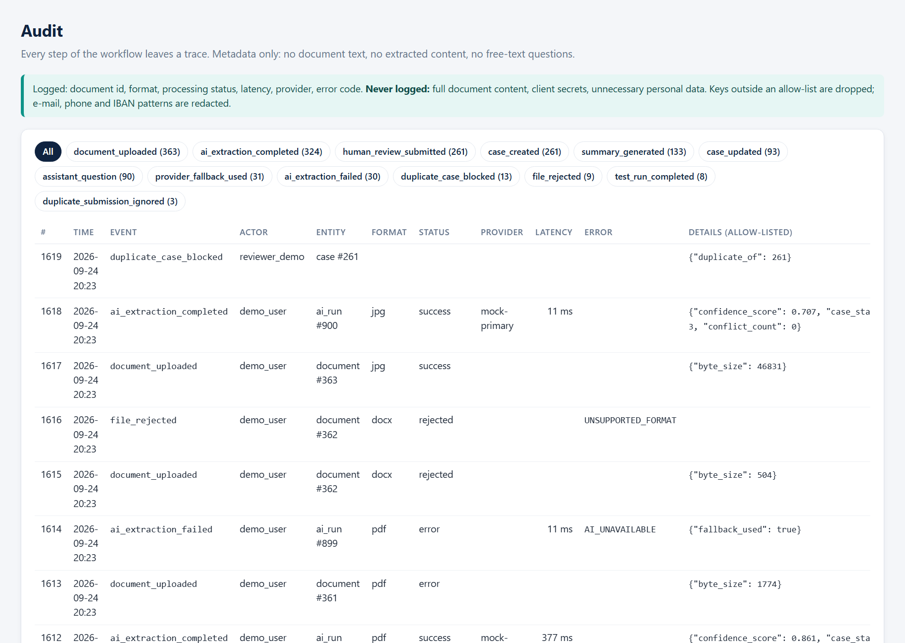

# LexLau / Klavis.app: AI-Assisted Legal Case Management
### Synthetic Portfolio Reconstruction

> **Synthetic demonstration data.
> No real client, legal-case or confidential LexLau/Klavis data is included.**
>
> Professional experience under technical supervision. Public reconstruction uses fully synthetic data
> and an independently implemented demo architecture. It is not a copy of Klavis code.



## Overview

A small but complete demo of an **AI-assisted legal case intake**: a document arrives (PDF, DOCX or
image), text is extracted, an AI layer structures it into case fields, the system checks what is missing
or contradictory, **a human reviews and corrects**, and only then is the case created. Around this
workflow: an assistant, a test framework, quality metrics, SQL analytics, a Power BI model and an audit
trail that never logs document content.

| | |
|---|---|
| 260 synthetic cases | 319 synthetic documents (PDF, DOCX, PNG, JPG; 8 variants) + ground truth |
| 892 AI runs | extraction, category suggestion, summary, assistant |
| 9 tables, 6 views | `database/klavis_ai_demo.sqlite`, 26 SQL analyses |
| 73 automated tests | incl. scenario suite TEST 001-014, all passing; 5 replayable synthetic bugs |
| 8 proofs | `proofs/`, taken from the running app and the database |
| Runs without an API key | default provider = deterministic local engine |

## Professional Context

At **LexLau**, Harry Mulembwe worked as an **AI Engineer & Data Analyst Intern** on **Klavis.app /
KlavIA**, a legal application with many AI-enabled features. Working under the supervision of the
CTO / technical supervisor, he:

- contributed to the development and testing of AI-enabled workflows;
- analysed, structured and processed data used in those workflows;
- tested AI features systematically and documented the observed behaviour;
- reproduced bugs and analysed gaps between expected and actual behaviour;
- turned test results into product and technical feedback;
- worked with potentially confidential data and data-protection requirements;
- worked in an environment with branches, Merge Requests, reviews and retests.

> I contributed to the development, testing and improvement of AI-enabled workflows within Klavis
> under technical supervision.

## Business / Product Problem

Legal professionals work with documents that hold a lot of structured and unstructured information.
Extracting it by hand is slow and error-prone. AI can speed this up, but a wrong extraction, a missing
field or unreliable behaviour creates real operational risk.

So the question is not *"Can AI extract information?"*. It is:

> **"Can the workflow produce structured information reliably enough for a professional to review and use?"**

## My Role

| Real professional experience (LexLau) | Public portfolio reconstruction (this repository) |
|---|---|
| AI-enabled application testing | Synthetic legal documents |
| Data analysis and structuring | Synthetic database |
| AI workflow validation | Public AI workflow |
| Bug reproduction | Automated tests |
| Documentation | SQL analytics |
| Product / technical feedback | AI quality dashboard |
| Confidential-data awareness | Technical documentation |
| Work under CTO / technical supervision | Reproducible demo |

The public project is a reconstruction designed to demonstrate the workflow without exposing
LexLau/Klavis intellectual property or confidential client information. Harry was not the CTO, the lead
architect or the sole developer, and did not approve his own changes (see
[CTO review workflow](docs/CTO_REVIEW_WORKFLOW.md)).

## Synthetic Reconstruction Disclosure

- Every person, company, municipality, case reference, amount and document is **invented** and
  generated by [`scripts/synthetic_documents.py`](scripts/synthetic_documents.py). Every document says so
  in its first line.
- **No** LexLau/Klavis code, prompt, schema, configuration, document, database, log or test report was
  copied. The proprietary code was not opened for this project ([audit](docs/AUDIT_EXISTANT.md)).
- The five bugs are **synthetic**. They reproduce the *type* of AI workflow issues investigated during
  the experience, using fully synthetic implementations. They are not Klavis production bugs.
- Simulated on purpose, and flagged in the data: OCR (text layer embedded in generated images), provider
  latency and outages, reviewers in the dataset.

## Architecture

```text
Document → Ingestion (format from content, upload rules) → Text (pypdf / DOCX XML / simulated OCR)
→ AI analysis: PRIMARY mock ──failure──► FALLBACK mock ──failure──► structured error
→ Checks (missing, incomplete, conflicts, confidence) → Human validation → Case (duplicate guard)
→ SQLite (+ audit) → Tests · SQL analytics · Power BI → Product feedback
```

Python standard-library HTTP server + vanilla JS front end; `pypdf` and `Pillow` are the only runtime
packages. Details: [docs/ARCHITECTURE.md](docs/ARCHITECTURE.md).

## AI Workflow

| Feature | Implementation |
|---|---|
| Provider abstraction | `AIProvider` → `MockAIProvider` (default), `MockFallbackProvider`, optional `OpenAIProvider` / `AnthropicProvider` (env vars, off without a key) |
| Resilience | `ai/fallback.py`: primary → fallback → `{"status": "error", "error_code": "AI_UNAVAILABLE"}`; every attempt recorded |
| Extraction | `ai/extraction.py`: structured JSON + field confidence + method |
| Category suggestion | simple fictional taxonomy (6 categories), always editable |
| Generate Case Summary | from the validated fields: *"AI-generated draft for demonstration purposes. Human validation required."* |
| Demo assistant | questions about the current synthetic case: *"Demo assistant — not legal advice."*; refuses advice questions |

```json
{
  "case_title": "Late payment for delivered IT hardware",
  "case_reference": "SYN-26-90004",
  "client_name": null,
  "opposing_party": "Lindenbrook Retail NV",
  "document_type": "Invoice dispute letter",
  "jurisdiction": null,
  "important_dates": [{"label": "incident_date", "date": "2025-09-13", "raw": "13/09/2025", "incomplete": false}],
  "amounts": [{"label": "late_interest", "value": 366.26, "currency": "EUR"}],
  "case_category": "Commercial dispute",
  "case_status": "Missing Information",
  "missing_fields": ["client_name", "jurisdiction", "amounts"],
  "confidence_score": 0.707
}
```
*(AI draft of the degraded phone photo sample: the reviewer completes it before the case is created.)*

## Document Processing

| Format | Text extraction | Variants generated |
|---|---|---|
| PDF | pypdf (text layer) | clean, degraded (OCR-noise text layer), multi-page, missing fields, contradictory |
| DOCX | `word/document.xml` via zipfile | clean, missing fields, contradictory |
| PNG / JPG | simulated OCR: the text layer embedded in the image | clean, degraded (rotated, blurred, noisy + noisier text) |

The format is detected from the content (magic bytes), not from the name. Empty, oversized (> 5 MB) and
unsupported files are rejected before any AI call.

## Structured Data

9 scored fields per document: title, reference, client, opposing party, document type, jurisdiction,
dates (labelled, ISO), amounts (labelled, EUR), category. Plus `summary`, `case_status`,
`missing_fields` and `confidence_score`. Each field keeps its AI value, confidence, method, missing and
conflict flags, ground truth, validated value and whether a human corrected it
([data dictionary](docs/DATA_DICTIONARY.md)).

## Human Review

**AI proposes → Human reviews → Application persists.** The reviewer sees every field with its
confidence, the missing fields in red and conflicts in amber. The reviewer edits, then ticks *"I reviewed
the proposed fields"* before *Confirm & create case* is enabled. The API refuses a case without
`validated: true`.



## Testing Strategy

73 automated tests (unit, integration, end-to-end over HTTP) and the scenario suite
**TEST 001-014** (clean PDF, DOCX, clean / degraded image, missing field, multiple dates, provider
failure, both providers down, duplicate submission, human correction, invalid file, oversized file,
mixed formats, regression). Each synthetic bug can be replayed, and **the suite is tested against the
bugs**: every switch must make its scenario fail. Result: 73 passed, 0 failed
([report](docs/TEST_REPORT.md), [strategy](docs/TEST_STRATEGY.md)).



## AI Quality Metrics

Measured against the ground truth of every synthetic document ([framework](docs/AI_QUALITY_FRAMEWORK.md)):

| Metric | Value | | Metric | Value |
|---|---:|---|---|---:|
| Document success rate | 91.7% | | Fallback rate | 9.7% |
| Field accuracy | 92.9% | | Error rate | 8.3% |
| Completeness | 97.9% | | Average confidence | 0.89 |
| Manual correction rate | 6.4% | | Human review rate | 27.8% |
| Test pass rate (latest run) | 100% | | Avg processing time (latency model) | 1.68 s |

*Values from the synthetic demonstration dataset, not from Klavis.*

## Bug Investigation

Five synthetic bugs, each documented as symptom → reproduction → observed / expected → hypothesis → root
cause → fix → retest → final status ([cases](docs/BUG_INVESTIGATION_CASES.md)): DOCX routed to the PDF
parser, category mismatch ("board" inside "cardboard"), duplicate case creation, fallback recorded under
the wrong provider, missing amount returned as 0.00. The history shows a fixed bug coming back through a
merge, caught by the regression suite.



## SQL Analytics

`sql/schema.sql` (keys, CHECK, UNIQUE), `sql/views.sql` (`vw_ai_quality_summary`,
`vw_document_type_performance`, `vw_field_accuracy`, `vw_test_run_summary`, `vw_human_review_metrics`,
`vw_error_analysis`), `sql/analysis_queries.sql` (26 queries: success by file type, completeness,
confidence bands, manual corrections, errors by stage, fallback, provider performance, latency,
review, missing-field frequency, test pass rate, regressions, Create Case success, duplicate prevention,
trends with window functions) and `sql/full_database_dump.sql`. All results:
[docs/SQL_ANALYSIS_RESULTS.md](docs/SQL_ANALYSIS_RESULTS.md).



## Power BI

A star schema (DimDate, DimDocumentType, DimAIProvider, DimTestScenario, FactAIRuns,
FactFieldExtraction, FactHumanReview, FactTestResults, + FactAuditEvents), **42 DAX measures** (Total AI
Runs … Image Success Rate %) and a **5-page report** (AI Quality Overview, Document Extraction, Field
Quality, Testing & Reliability, Human Review & Data Quality), generated as a **Power BI Project
(PBIP)**. The model loads in the Power BI engine (Microsoft's Power BI Modeling MCP server: 9 tables,
11 relationships, 42 measures). Opened in Power BI Desktop, its DAX results were compared with SQL:
**85/85 comparisons match** ([reconciliation](docs/POWERBI_SQL_RECONCILIATION.md)). See
[powerbi/](powerbi/DATA_MODEL.md), [DAX](powerbi/DAX_MEASURES.md), [spec](powerbi/DASHBOARD_SPEC.md) and the
[5 page screenshots](powerbi/screenshots/). A `.pbix` can be saved from the PBIP in Power BI Desktop
(*File → Save as*). It is not generated by script.



| Page | Screenshot |
|---|---|
| 1 AI Quality Overview | [powerbi_01](powerbi/screenshots/powerbi_01_ai_quality_overview.png) |
| 2 Document Extraction | [powerbi_02](powerbi/screenshots/powerbi_02_document_extraction.png) |
| 3 Field Quality | [powerbi_03](powerbi/screenshots/powerbi_03_field_quality.png) |
| 4 Testing & Reliability | [powerbi_04](powerbi/screenshots/powerbi_04_testing_reliability.png) |
| 5 Human Review & Data Quality | [powerbi_05](powerbi/screenshots/powerbi_05_human_review_data_quality.png) |

The same metrics are live on the app's **AI Quality** page ([screenshot](proofs/app_ai_quality_page.png)).

## Data Protection

Data minimisation (no document text in the database or logs; the summary and the assistant only see
structured fields), allow-listed and redacted logging, no secrets (`.env.example` only), human review,
audit trail, environment separation, retention awareness ([details](docs/DATA_PRIVACY.md),
[scan](docs/SECURITY_SCAN.md): 0 blocking findings).



## Proof of Work

| Proof | Shows |
|---|---|
| [proof_01_ai_extraction](proofs/proof_01_ai_extraction.png) | synthetic document + structured, scored result |
| [proof_02_human_validation](proofs/proof_02_human_validation.png) | AI flags → human corrections → validated case |
| [proof_03_data_model](proofs/proof_03_data_model.png) | relational model with row counts |
| [proof_04_test_suite](proofs/proof_04_test_suite.png) | TEST 001-014 × 8 runs |
| [proof_05_bug_investigation](proofs/proof_05_bug_investigation.png) | bug → root cause → retest |
| [proof_06_ai_quality_dashboard](proofs/proof_06_ai_quality_dashboard.png) | AI quality dashboard (Power BI, page 1 of 5) |
| [proof_07_sql_analysis](proofs/proof_07_sql_analysis.png) | real SQL + results |
| [proof_08_audit_log](proofs/proof_08_audit_log.png) | audit without sensitive data |

## Skills Demonstrated

AI workflows · data extraction · structured data · data quality · testing & QA · root-cause
investigation · documentation · product feedback · SQL · Python · analytics / Power BI · data
protection · human-in-the-loop AI.

## Repository Structure

```text
ai/                     provider interface, mock + optional providers, fallback, extraction, category,
                        summary, assistant, evaluation, safe logging, bug replay
app/backend/            services (persistence, validation, duplicate guard) + HTTP JSON API
app/frontend/           8-page single-page app
data/                   synthetic_documents/ (319 files), synthetic_*.csv, ground_truth.json
database/               klavis_ai_demo.sqlite
sql/                    schema, views, 26 analysis queries, full dump
tests/                  unit/, integration/, e2e/ (TEST 001-014, HTTP), fixtures/
powerbi/                data/ (star CSV), Klavis_AI_Quality/ (PBIP), DAX_MEASURES, DATA_MODEL, DASHBOARD_SPEC
proofs/                 8 portfolio proofs
docs/                   architecture, dictionary, privacy, quality, tests, bugs, CTO review, insights, QA ...
scripts/                generators, exports, proofs, security scan
run_pipeline.py         rebuild everything
```

## How to Run

```bash
pip install -r requirements.txt
python -m app.backend.server            # http://127.0.0.1:8765 - no API key needed
python scripts/run_tests.py             # 73 tests
python run_pipeline.py                  # rebuild documents, dataset, SQL, Power BI, tests, proofs, scan
LEXLAU_BUG_REPLAY=docx_routing python -m app.backend.server     # replay a synthetic bug
```

The app works on `database/app_runtime.sqlite`, a copy of the reference database. Delete it to reset
the demo. Optional external providers: see `.env.example` (synthetic documents only).

## Limitations

- Synthetic documents are cleaner and more regular than many real legal documents.
- The mock AI is a deterministic rule engine. It cannot reproduce all the behaviours of commercial LLMs.
- OCR is simulated; latency, outages and reviewers are simulated in the dataset (and flagged).
- Confidence scores are demonstration metrics, not calibrated probabilities.
- The public reconstruction intentionally simplifies the original production architecture.
- The repository does not reproduce LexLau/Klavis proprietary code.
- The project demonstrates methodology and skills, not the production system itself.

## Confidentiality

No client data, real legal case, internal prompt, confidential architecture, credential, API key,
secret, identifier, real e-mail, real legal document, internal URL, production log or proprietary
database schema is included. See [docs/DATA_PRIVACY.md](docs/DATA_PRIVACY.md) and
[docs/SECURITY_SCAN.md](docs/SECURITY_SCAN.md). Final checks: [docs/FINAL_QA.md](docs/FINAL_QA.md).
