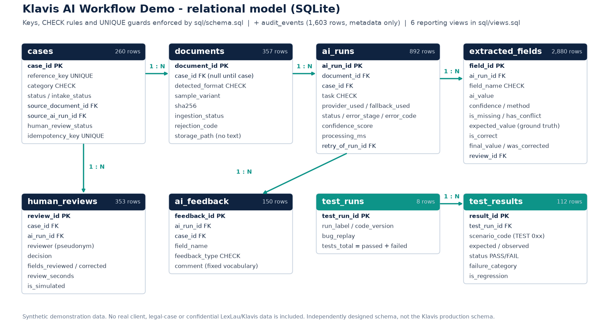

# Power BI data model

> Synthetic demonstration data. No real client, legal-case or confidential LexLau/Klavis data is included.

The BI model is a **star schema** built from the SQLite database by `scripts/export_powerbi_data.py`
(CSV in `powerbi/data/`). No free text leaves the database: case titles, names and document content
are not exported.

## Tables

| Table | Type | Grain | Rows | Key |
|---|---|---|---:|---|
| DimDate | Dimension (date table) | day, Jan-Jul 2026 | 212 | `date` (key), `date_key` (join) |
| DimDocumentType | Dimension | file family × format × variant (e.g. "Image JPG - degraded") | 13 | `document_type_id` |
| DimAIProvider | Dimension | provider (mock-primary, mock-fallback, none) | 3 | `provider_id` |
| DimTestScenario | Dimension | TEST 001-014 with expected result and guarded risk | 14 | `scenario_code` |
| FactAIRuns | Fact | one AI run (all tasks) | 892 | `ai_run_id` |
| FactFieldExtraction | Fact | one field of one successful extraction | 2,880 | `field_id` |
| FactHumanReview | Fact | one human review | 353 | `review_id` |
| FactTestResults | Fact | one scenario in one test run | 112 | `result_id` |
| FactAuditEvents | Fact | one audit event (metadata only) | 1,603 | `event_id` |

## Relationships (11, all one-to-many, single direction)

| From (many) | To (one) |
|---|---|
| FactAIRuns[date_key], FactFieldExtraction[date_key], FactHumanReview[date_key], FactTestResults[date_key], FactAuditEvents[date_key] | DimDate[date_key] |
| FactAIRuns[document_type_id], FactFieldExtraction[document_type_id], FactHumanReview[document_type_id] | DimDocumentType[document_type_id] |
| FactAIRuns[provider_id], FactFieldExtraction[provider_id] | DimAIProvider[provider_id] |
| FactTestResults[scenario_code] | DimTestScenario[scenario_code] |

### Why these choices

- **No fact-to-fact relationship.** FactFieldExtraction carries its run's date, document type and
  provider, so it is filtered by the same dimensions without a many-to-many path through FactAIRuns.
- **Field quality lives at field grain** (2,880 rows), so accuracy, completeness and correction rates
  are exact ratios, not averages of averages.
- **Run-level quality measures filter on `task = "extraction"`** (confidence, latency, fallback, review
  rate); `Total AI Runs` counts every task.
- **FactHumanReview is related to the document type of the case's source document**, so the file-type
  slicer also filters review metrics.
- **Test results use their run date**, so the month slicer shows the test history of the period.
- Technical keys and 0/1 flags are hidden; `discourageImplicitMeasures` is on: every number comes from an
  explicit measure ([DAX_MEASURES.md](DAX_MEASURES.md)). Sort-by columns keep document types, scenarios
  and test runs in a logical order.

## Power BI Project (PBIP)

`powerbi/Klavis_AI_Quality/` is generated by `scripts/build_powerbi_project.py`:

- `Klavis_AI_Quality.SemanticModel/definition/`: TMDL with 9 tables, types, Power Query partitions
  reading the CSV folder (`DataFolder` parameter), 11 relationships, 42 measures in display folders;
- `Klavis_AI_Quality.Report/report.json`: the 5 pages of [DASHBOARD_SPEC.md](DASHBOARD_SPEC.md).

**Validation:** `scripts/validate_powerbi_model.py` loads the TMDL folder with Microsoft's Power BI
Modeling MCP server (the Analysis Services engine behind Power BI Desktop): *"PASS: TMDL model imported
by the Power BI engine - 9 tables, 100 columns, 11 relationships, 42 measures"*.
`scripts/reconcile_powerbi_sql.py` compared the DAX results with SQL with the PBIP open in Power BI Desktop:
**85/85 PASS** ([report](../docs/POWERBI_SQL_RECONCILIATION.md)). Screenshots of the 5 pages:
[screenshots/](screenshots/).

**About the `.pbix`:** a `.pbix` is a binary file written by Power BI Desktop. It is produced from the
PBIP with *File → Save as*. This repository does not claim to contain a `.pbix` generated by a script.
